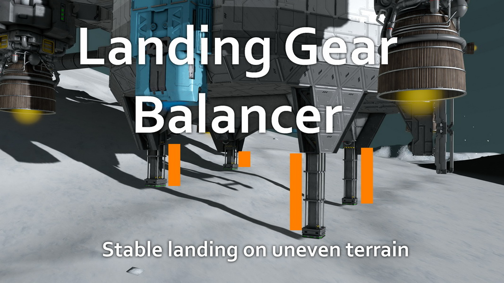
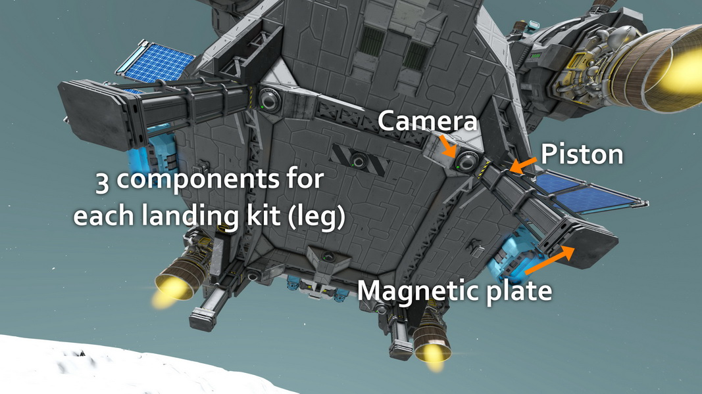

# SE_LandingGearBalancer
Landing Gear Balancer script for Space Engineers

Adjustable landing gear pistons to compensate for uneven terrain and land with your ship horizontal.

- Version 1.0 - 2024-12-21 - First public release
- Version 1.1 - 2025-01-03 - Added a timer before turning off, for commands "retract" and "extend"
- Version 1.2 - 2025-07-06 -  Supports up to 100 landing gear kits !
                            Detects and warns about obstructed cameras
                            Shows on screen if in long legs or short legs mode
- Version 1.3 - 2025-12-07 -  Added "unlock_retract", "unlock_extend", "unlock" commands
                            Works when landing on grids (ex : large grid landing pad that is not level for some reason)

Designed for use with:
- Up to 100 landing gear kits (1 kit = piston+landingpad+camera)

## Functions
- use one downward-facing camera on each landing kit to measure distance from ground
- adjust the lenght of all landing gear pistons to compensate
- provide warning if the terrain is too uneven
- in long legs mode, all pistons are extended by default, and they retract if needed due to uneven terrain
- in short legs mode, all pistons are retracted by default, and they extend if needed due to uneven terrain
- the script activates autolock on each leg, and turns itself off when one has locked

## Installation

- Set up to 100 landing kits, with a magnetic plate on a piston, and a downward facing camera as close as possible (but with a direct, unobstructed view of the ground)
- Create groups for each landing kit, named LGB_kit1, LGB_kit2 etc. with the 3 items in each
- The names must be continuous, starting at 1 and going up to 100 (LGB_kit1, LGB_kit2, ..., LGB_kit100). If there is one missing (ex: LGB_kit1, LGB_kit2, LGB_kit4), the script will stop at LGB_kit2
- (optional) Install an LCD screen with the proper name (see below) to see what the script does
- install the script in a programmable block
- recompile the script if needed to let it autoconfigure itself

## Usage
- When close the the ground, activate the script in long legs or short legs mode
- Keep the ship horizontal yourself, or use another script (ex: Flight Assist) to do it
- The script start to check the ground below an altitude of 100m (configurable)
- If the ground is too uneven, thescript does it best and the LCD turns red.

## Command line arguments
- off: turns the script off (ex : when already landed, etc.) without moving the pistons
- on: activate the leg balancer, preferring long legs
- on_longlegs: activate the leg balancer, preferring long legs
- on_shortlegs: activate the leg balancer, short long legs
- retract: retract all legs, and turn the script off
- extend: extend all legs, and turn the script off
- unlock_retract: unlock and retract all legs, then turn the script off
- unlock_extend: unlock and extend all legs, then turn the script off
- unlock: unlock all legs

## FAQ/Issues

A few troubleshooting suggestions :
- Look at what the programming block says when you compile the script. It should say "Group +name+ found !" and "Group +name+ has the correct setup (1 camera, 1 piston, 1 gear)" for each of the landing kits
- Look at what the display screen say ? If "ground uneveness" is always 0 when above rugged terrain, it's the sign that the cameras can't measure distance properly.
- Switch between on_longlegs and on_shortlegs. Do the pistons move ?
- If the displays says "Obstructed camera on kit#" it means the camera points at the ship instead of the ground. Activate the view from the camera to see what blocks are blocking the view (only the exact center of the view needs to be clear)